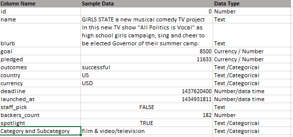
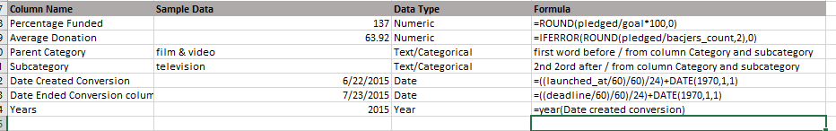
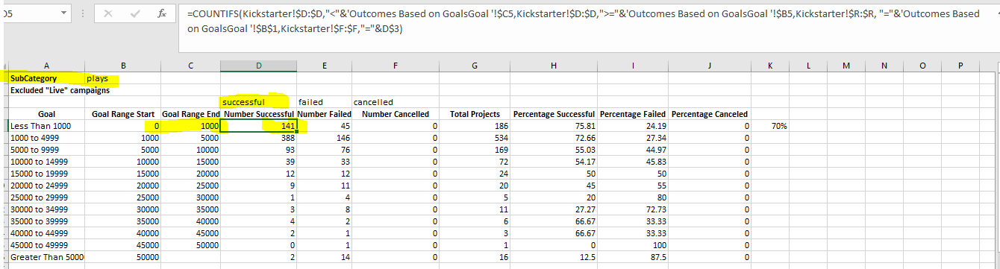
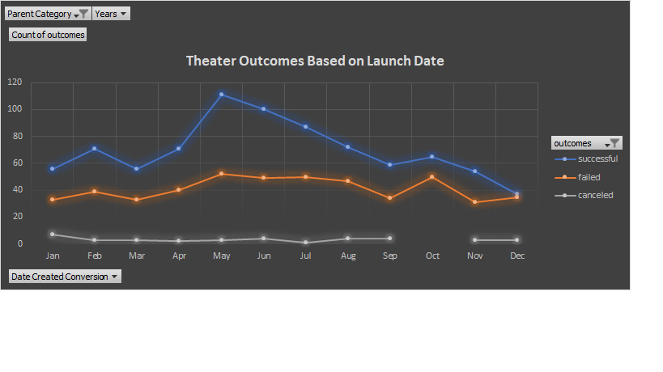
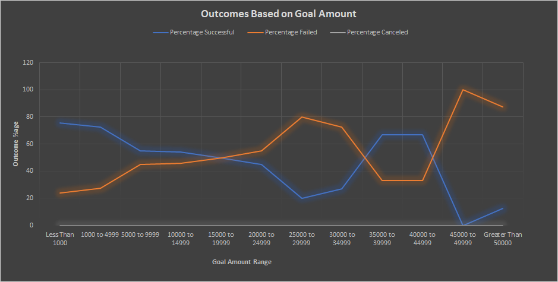
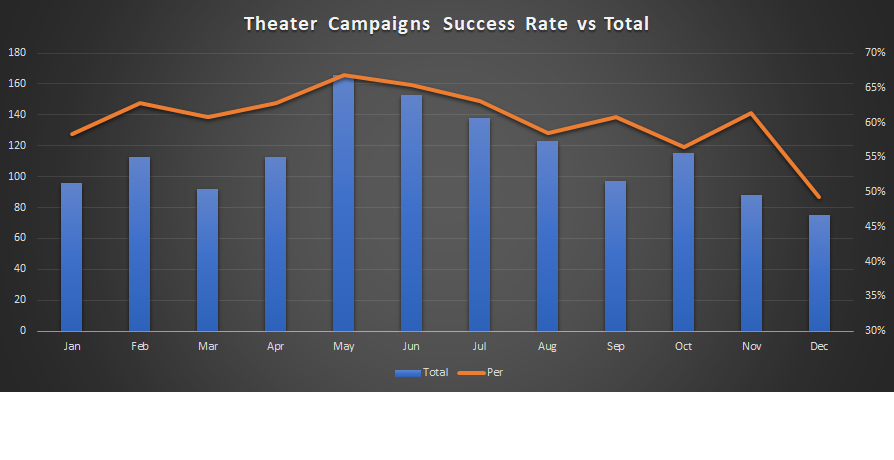

# Kickstarting with Excel - Challenge 1 UofT Data Analytics Boot Camp 2020/21

## Overview of Project
Kickstarter is a crowdfunding platform that help ideators to bring their ideas to reality by running campaigns to secure funds and backers. 
Please see the [About Kickstarter](https://www.kickstarter.com/about?ref=global-footer) for more details.

The porject uses Excel to analyse the campaign level data for past campaings from  Kickstarter  platform.
The dataset can be downloaded from [Kickstarter campaign data](https://2u-data-curriculum-team.s3.amazonaws.com/dataviz-online/module_1/data-1-1-3-StarterBook.xlsx)

### Purpose
Challenge 1 requires analysis of the kickstarter past campaign data . The obective of the analysis is to understand how the goal amounts and luanch month impact the success rate of kickstarter campaigns. This analysis will help Louise, whoe is a play writer, to plans her next campaign.

### Analysis

#### Details about the data downloaded
The data covers campaigns ran during a period of 9 years from 2009 to 2017. The campaigns are categorized into a wide range of categories. In order to do the analysis the data was filterd down to similar campaign based on the category. As the analysis is for a play writer for funding needed for new plays. The first steps was to identify data for similar universe. 
##### Steps for identifying data universe:

1. The data has a 'category/sub category' column with multiple values for 'theater'. So it was decided to user filter to reduce the down to anything realted to Theater.
2. Futher analysis revealed that "subcategory sapces" under category "theater" could have much higher goal amount and not linked to play directly. so the universe is futher reduced to focus on plays sub category.
3. In addition, the camapgin launch dates values were not in the regular data format. So a new column was created and a formula is used to convert the data into proper date fromat. 

##### Data and format found in the kickstarter campaign data.
**

**

##### Steps for Analysis:

1. Created pivot table and pivot chart for "Category Theater" by launch date month as row and outcomes as columns. Created the line chart using the pivot data .
2. Created a summary of no of campagins for each outcome by a range of goal amounts. Used Countifs function to calculated the no of campaigns for each outcome and goal range. I've used formual derived from the cell values, so we can easily repeate the analytis for an sub category.

### Challenges

I didn't encounter any specific challenges while doing the analysis, I think for someone new to data anlayis I would recomend them to rememebr to perform data validations and QA at after different stages of the data transformation.
E.g when preparing the data for 2nd part of analysis (i.e outcomes by goal amount), we had to do some data transformtaion. I did some verification for total by comparing the output from formula vs  row counts from "Kickstarter" data sheet by filtering down the columns. Basically validating the totals are matching the expected total.
QA and validation /testing is a very important step for any data analysis.

## Results

- What are two conclusions you can draw about the Outcomes based on Launch Date?

  Based on the above graph I came to following conlcusions.
    1. May and June have the highest numbers of successfull campaigns. Combine together they reporesent 23% of total campaigns luanched vs 25% of successfull campaigns.
    2. In addition from the montsh of Nov to Jan the no of campaigns luanched per month are lower relative to other months of the year. 
    3. Success rate is similar during the months from April to Aug. 

- What can you conclude about the Outcomes based on Goals?

   **
    
    Higher the goal amount is the lower the success rate will be. The rate break even at 15000 amount. The chances of success are the highest with the goal amount less than 10K
  
- What are some limitations of this dataset?
  1. The data doesn't have the campaign cost to understand the ROI.
  2. The data is not recent so may not reflect new trends.
  
- What are some other possible tables and/or graphs that we could create?
  1. For outcomes by goal amount, I did additional graph to compare success rate against total campaigns to come to the conclusion we've very close success rate for middle of the year.
  
  
  2. In addition I would suggest to analyse campaigns by "Staff pick", and by "sptlight" to see if these two attributes imapct success rate in any way.
  
